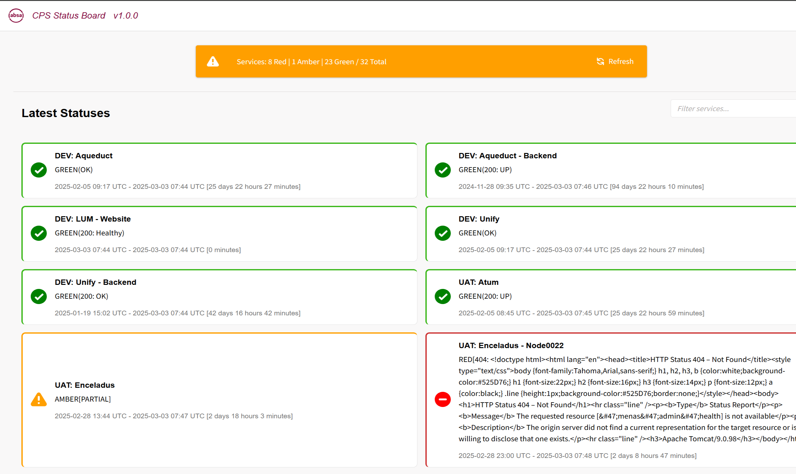
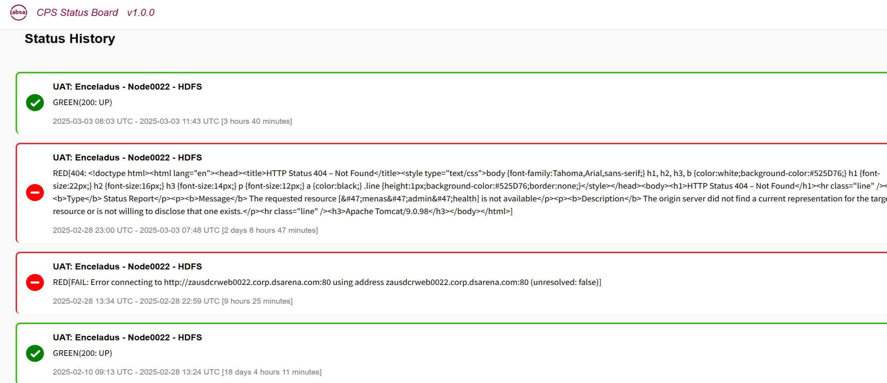

# Status Board
CPS Status Board is a real-time monitoring platform built specifically for ABSA. It is designed to serve both as a critical operational dashboard and as an introductory tool into the broader CPS tooling ecosystem. By presenting only top-level services initially, it offers an uncluttered, intuitive interface that allows everyday users to quickly grasp the overall system status while still providing the ability to drill down for more detailed information. The integrated filtering capabilities and historical views of status changes and maintenance messages ensure that users can easily track service performance and diagnose issues over time.




<!-- toc -->
- [Features](#features)
- [Running](#running)
- [Testing](#testing)
- [Rest API](#rest-api)
- [Dependencies](#dependencies)
- [Customizations](#customizations)
- [Architecture](#architecture)
- [Release Cycle](#release-cycle)
<!-- tocstop -->

## Features

- Monitor services health status
  - supports custom maintenance message (i.e. for expected downtime)
  - HTTP based health checks
  - AWS SDK based health checks
  - [wiki - List of all supported checkers](https://github.com/absa-group/status-board/wiki/Supported-checkers) 
- Keep history of status changes
- Provide latest view of services statuses
- Reports status changes via notifications (EMail, MSTeams)

## Running

### Running Service Directly
- ensure you meet all [Dependencies](#dependencies)
- get your hands on assembly at `target\scala-2.13\status-board-assembly-<some numbers>-SNAPSHOT.jar` after you `sbt assembly`
- prepare your `config.conf` based on reference one
- start it
  ```
  java -Dconfig.file=./config.conf -jar status-board-assembly-<some numbers>-SNAPSHOT.jar >log.log 2>err.log
  ```

### Running Service Dockerized
- ensure you meet all [Dependencies](#dependencies)
- make assembly at `target\scala-2.13\status-board-assembly-<some numbers>-SNAPSHOT.jar` after you `sbt assembly`
  - make sure there is EXACTLY ONE jar file (or provide exact path to docker build command)
- build docker (**[follow comments at the top of Dockerfile](./Dockerfile)**)
  - no config provided at this step - defaults to one baked in the jar
- run docker (**[follow comments at the top of Dockerfile](./Dockerfile)**)
  - you can override the config with yours at this step

### Running UI
**[follow UI readme](./ui/README.md)**

## Testing

All tests are run by sbt command

| sbt command       | Test                 | Info                                                                                                                   |
|-------------------|----------------------|------------------------------------------------------------------------------------------------------------------------|
| `sbt test`        | Unit tests           | Basic unit tests, should always pass with no external dependency                                                       |
| `sbt testDynamo`  | DynamoDB             | (Re)create the table at start and destroys it afterwards<br/> - i.e. **don't use data-carrying table** in test config  |
| `sbt testSMTP`    | SMTP Client          | Only tests sending of the mail<br/> - i.e. external effect of observing it arrive is up to tester                      |
| `sbt testMSTeams` | MS Teams Hook        | Only tests sending of the message<br/> - i.e. external effect of observing it arrive is up to tester                   |
| `sbt jacoco`      | Jacoco code coverage | Runs all possible tests with code coverage - i.e. you need environment setup for all previous unit/integration tests   |

## Rest API
Can be found on [wiki - REST-API](https://github.com/absa-group/status-board/wiki/REST-API)

or directly accessed on swagger pages `GET /docs`


## Dependencies

### JRE
JRE 21 (Currently developed on Corretto 21)

### AWS
Status-Board requires AWS environment to be set (regardless of AWS related monitoring being used)
	
These variables are required to be set: 
 - region
 - access_key_id
 - secret_access_key
 - session_token

When AWS is not required and AWS SDK configs are not present on the system, following setup could be used instead
  - Windows:
    ```
    SET AWS_REGION=ignored
    SET AWS_ACCESS_KEY_ID=ignored
    SET AWS_SECRET_ACCESS_KEY=ignored
    SET AWS_SESSION_TOKEN=ignored
    ```
  - Unix:
    ```
    export AWS_REGION=ignored
    export AWS_ACCESS_KEY_ID=ignored
    export AWS_SECRET_ACCESS_KEY=ignored
    export AWS_SESSION_TOKEN=ignored
    ```

### DynamoDB
Status-Board uses DynamoDB as persistence layer

endpoint can be overridden from the config
 - when using non-aws (local) DynamoDB
 - when using DynamoDB that differs from one in AWS environment

#### Running local DynamoDB
 - grab [Local DynamoDB](https://docs.aws.amazon.com/amazondynamodb/latest/developerguide/DynamoDBLocal.DownloadingAndRunning.html)
 - run local DynamoDB
   - directly as jar
      ```shell
      java -Djava.library.path=./DynamoDBLocal_lib -jar DynamoDBLocal.jar -sharedDb
      ```
   - dockerized
   - via docker-compose.yml 
     - assuming you have DynamoDB set up at "./docker/dynamodb:/home/dynamodblocal/data"
      ```shell
      sudo docker-compose up
      ```

#### DynamoDB Tables
names of tables used are set from the config

Unit tests are creating and destroying DynamoDB tables on their own

Status-Board itself attempts to create DynamoDB tables if they are not present on startup, otherwise it uses the ones present


## Customizations

### Mail templates

Mail templates support these variables

| Variable                     | Replacement                                                                                                                   |
|------------------------------|-------------------------------------------------------------------------------------------------------------------------------|
| `{{ ENV }}`                  | Environment                                                                                                                   |
| `{{ SERVICE_NAME }}`         | Service Name                                                                                                                  |
| `{{ MAINTENANCE_MESSAAGE }}` | Maintenance Message                                                                                                           |
| `{{ STATUS_COLOR }}`         | Green/Amber/Red/Black                                                                                                         |
| `{{ STATUS_COLOR_LABEL }}`   | Customized label for status color (default 🟥, 🟨, 🟩, ⬛)                                                                     | 
| `{{ STATUS_MESSAGE }}`       | Message portion of the status                                                                                                 |
| `{{ STATUS_INTERMITTENT }}`  | Whether given status is considered intermittent                                                                               |
| `{{ STATUS }}`               | Status message including color and intermittentness<br>i.e.<br>`Green(Am OK)`<br>`Red(Am borked)`<br>`Red[NetworkStruggling]` |
| `{{ FIRST_SEEN }}`           | Time of this status to be seen first time                                                                                     |
| `{{ LAST_SEEN }}`            | Time of this status to be seen last time                                                                                      |
| `{{ DURATION_SEEN }}`        | Duration between `FIRST_SEEN` - `LAST_SEEN` (i.e. how long is service in is state)                                            |
| `{{ NOTIFICATION_SENT }}`    | Whether notification of service being in this state was sent (i.e. intermittent failures are not reported immediatelly)       |

## Architecture
Can be found on [wiki - Architecture](https://github.com/absa-group/status-board/wiki/Architecture)

## Release Cycle

- VERSION file
  - this is source of truth of the version
  - SBT picks the version automatically
  - Angular requires syncing script to run after change
    - is pre-hooked to common npm actions
    - can be triggered explicitly from ui folder `npm run sync-version`

- Non-Release PR merge to Master and deployments
  - Commits are squashed
    - 1 merge <=> 1 commit ball
  - Every commit carries semver version with -SNAPSHOT suffix
    - semver is (usually) next minor against latest release 
  - After successful merge, **DEV environment** is **deployed automatically**
    - deployment workflow replaces -SNAPSHOT suffix with SHA1
    - manually triggered **PROD environment deployment** is **likely** to follow soon

- Release workflow
  - PR Merge version with non-suffix semver
    - DEV environment gets deployed automatically (before release is done)
  - Trigger release-draft workflow with matching label (without -SNAPSHOT) to latest commit in Master
    - this creates release draft 
  - perform GitHub release
    - use draft prepared by previous step
  - optionally trigger PROD environment deployment
